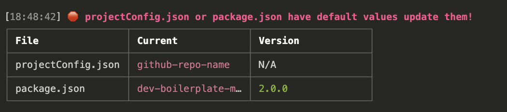

[](https://postimg.cc/bsDNKJmw)

# Dev boilerplate for modules v2

This boilerplate serves as a foundational template for projects that involve multiple brands or entities. It provides a starting point with pre-established configurations, code structures, and functionality that can be easily customized and extended for crossbrand projects.

<details>
<summary>⬇️ Installation requirements</summary>

- Node.js (at least version 20) [link](https://nodejs.org/en/)
- NPM [link](https://docs.npmjs.com/downloading-and-installing-node-js-and-npm)
- Gulp.js version 4 [link](https://gulpjs.com/docs/en/getting-started/quick-start)
- NVM to have multiple node version [link](https://github.com/nvm-sh/nvm)
- Prettier VSCODE EXTENSION: https://marketplace.visualstudio.com/items?itemName=esbenp.prettier-vscode

</details>

<details>
<summary>⬇️ Getting Started</summary>

### Configure the project

1. Update the `package.json` e `projectConfig.json` with the name of the project, and the version (1.0.0) to start.
   If the json are not updated an error will be displayed (in red the fields that must be updated) ad will block you to proceed in development.
   
2. run `npm install` or `npm i` or `pnpm i` to install all the dependencies
3. `npm run new` to create a new variant
4. _(optional)_ `npm run delete` to remove the default variant **BRAND_variantName**
5. Delete the boilerplate code in the HTML and js, you can search for TODO: to find all the code that must be deleted.

**projectConfig.json specs**

| Key               | Defaut                | Description                                                                                                           | Values                                                        |
| ----------------- | --------------------- | --------------------------------------------------------------------------------------------------------------------- | ------------------------------------------------------------- |
| **projectName**   | "Project Name"        | The name of the project, this name is used to create global variable of the module and the id of the module container |
| **serveInNewTab** | "false"               | Decide which URL to open automatically when Browsersync starts                                                        | "local" \| false \| "local" \| "external" \| "ui" \| "tunnel" |
| **langs**         | ["en-us"]             | The list of language code prompts on "serve" command                                                                  |                                                               |
| **variants**      | ["BRAND_variantName"] | The list of variant of the module code                                                                                | es "RB", "RB_holiday"                                         |

|

</details>

<details>
<summary>⬇️ Folder structure</summary>

```
/main-folder
  |-  /.tmp => contains temporany files that need to process
  |-  /dist => output folders and files will be here
  |-  /release => output folders for the build if release yes, with the version taken from package.json
  |-  /src
  |   |- /js
  |     |-  main.js
  |     |-  critical.js => critical js inserted directly in fragment/espot
  |     |-  contents.js
  |     |-  /modules
  |         |-  analytics.js
  |         |-  lazy.js
  |         |-  stateManager.js
  |         |-  utils.js
  |     |-  /variants
  |         |-  /BRAND_variantName
                |-  main.js
                |-  contents.js
                |-  info_store.js
  |-  /scss
  |   |-  main.scss
  |   |-  critical.scss => critical css inserted directly in fragment/espot
  |   |-  variables.scss
  |   |-  /components
  |   |-  /layout
  |   |-  /utils
  |       |-  _local.scss => style for dev envirment like fonts
  |       |-  _spacer.scss
  |       |-  _variables.scss
  |   |-  /variants
  |       |-  /BRAND_variantName
  |           |-  _variables.scss
  |           |-  main.scss
  |-  /views
  |   |-  index.pug
  |   |-  /main
  |       |-  main.pug => HTML shared between variants
  |       |-  /BRAND_variantName
  |           |-  main.pug => HTML specific of the variant
  |           |-  /components
  |           |-  /live
  |   |-  /template-parts
  |         |-  base.pug
  |         |-  footer.pug
  |         |-  head.pug
  |- /utils
  |   |-  /templates => set of files to init new variant
  |-  /tasks => here you will find all gulp tasks
  |-  .gitignore
  |-  package.json
  |-  vendor.js => insert here all vendors
  |-  prettier.config.js => prietter config
  |-  .npmrc => insert here your github token to download @luxotticacontentteam packages (if you don't have it installed globally)
  |-  projectConifig.json => contains the project details
  |-  CHANGELOG.md => insert here the major changes after the first release

```

</details>

<details>
<summary>⬇️ Env Commands</summary>

### `npm run dev` or `npm run serve`

The go-to command for development.

This does the following:

- Compiles sass (and runs any postcss plugins)
- Lints javascript
- Create separate vendor file callend `vendors.js` for libraries
- Builds webpack
- Injects the link to CSS and javascript sources
- Copies all frontend files to the `distFolder`.

Also, it spins up a static server using browsersync. Frontend of the site can be accessed at **http:localhost:347**.

### `npm run build`

Builds out production version of frontend code, it will ask you if you want craete a release, if yes, it create the files with the release number in the release folder.
The Release folder is tracked on github.

### `npm run new`

To create a new variant, starting from existing variant or from default templates (`utils/templates`)

### `npm run remove` or `npm run delete`

to remove a variant

### `npm run proxy`

start server proxy to avoid cors errors

### `npm run sprite <PATH_ICONS>`

    npm run sprite '/Users/magnonid/../module/src/static/icons'

it generates a **/sprite** folder inside the **/icons** folder, with the sprite.svg that is a sprite with all the icons inside the /icons folder

</details>

<details>
<summary>⬇️ Enviroment Feature</summary>

### Setup project brands

It is possible to configure the project brands within the package.json file in the projectConfigurations.brands section.

```
// package.json
{
  ...
  "projectConfigurations": {
    "variants": [
      "[BRAND]", // ex: RB
      "[BRAND_Variant]", // ex: RB_holiday
    ]
  },
  ...
}
```

### SCSS - file concat

It is possible to use a specific brand file to define custom rules. To do that, create a brand file in the brand folder:
`./src/scss/variants/[BRAND CODE]/main.scss`

This file will be contatenated with the `./src/scss/main.scss` file. Example:

```
// ./src/scss/variants/RB/main.scss
.RB-custom-rule {
  color: #000;
}
```

➕

```
// ./src/scss/main.scss
section {
  padding: 0;
}
```

🟰

```
// Output
section {
  padding: 0;
}

.RB-custom-rule {
  color: #000;
}
```

### SCSS - conditional brand

You can crete a custom condition based on brand value. Example:

```
$red: #ff0000;

@if($brand == 'RB'){
    $red: #e80c00;
}
```

### SCSS - critical.scss

The code inserted in this file with the build, is placed directly inside the HTML, usefull for skeleton if main needs to be uploaded asyncronously

### SCSS - \_local.scss

    @if ($env == "development") {}

with this statement is possible to insert code only for dev environemnt. In \_local.scss is used to include the fonts of the brand with the `conditional brand`

    @if ($brand == "RB") {
      @font-face {
        font-family: "Oswald";
        src: url(../static/fonts/RB/oswald...regular.woff2) format("woff");
        font-weight: normal;
        font-style: normal;
      }
    }

### VIEWS - isProd, != brandHtml, bannerName,crossOrigin

- **isProd** : to check if is dev enviroment, usefull to insert piece of HTML that are needed only in dev enviroment (maybe because already existing in the website)
- **!= brandHtml** : it allows to concat automatically the main.pug of the current variant. If the HTML is not different between variants you can remove it.
- **bannerName** : it takes the banner name from the projectConfig to create automatically the ID of module (it's normalized to have naming like this **nome_project_test**)

- **crossOrigin** : in dev is null, while is anonymous in prod, this allows to insert the crossOrigin attribute to the images without CORS errors.

### JS - critical.js

The code inserted in this file with the build, is placed directly inside the HTML.

### VIEWS - live

Here insert the path of the builded files uploaded on akamai. The build flow, will automatically concat this file in the HTML to past it in coremedia/WCS

### STATIC - fonts / fav

- a set of fonts of our brands are already included
- `fav.png` change it to update the favicon of the project

</details>

<details>
<summary>⬇️ Using the Analytics Module</summary>

The Analytics module is used to track user interactions on the website. Here is how to use it:

### Initialization

To initialize the Analytics module, use the `init` method. It takes two parameters:

- `env`: The environment in which the module is running (e.g., "development" or "production").
- `trackingId`: An optional tracking ID string.
- `moduleContainerSelector`: if not specified it takes `document` as container, it's highly reccomended to pass module container to avoid issue on tracking with multiple modules.

Example:

```javascript
import { Analytics } from "./modules/analytics";

Analytics.init({ env: "development", trackingId: "your-tracking-id", moduleContainerSelector: document.querySelector("#current_module_selector") });
```

### Adding Tracking to Elements

To add tracking to elements, ensure that the elements have a data-tracking-id attribute. The module will automatically add event listeners to these elements and track clicks.

Example HTML:

```
<button data-tracking-id="button1" data-tracking-description="Button Click">Click Me</button>
```

### Custom Event Tracking

If you need to manually push tracking data, use the analyticsPush method. It takes a data object as a parameter.

Example:

```
const trackingData = {
  id: "CustomEvent",
  Tracking_Type: "custom",
  data_element_id: "custom_event_id",
  data_description: "Custom event description",
  data_analytics_available_call: "1",
};

Analytics.analyticsPush(trackingData);
```

</details>
